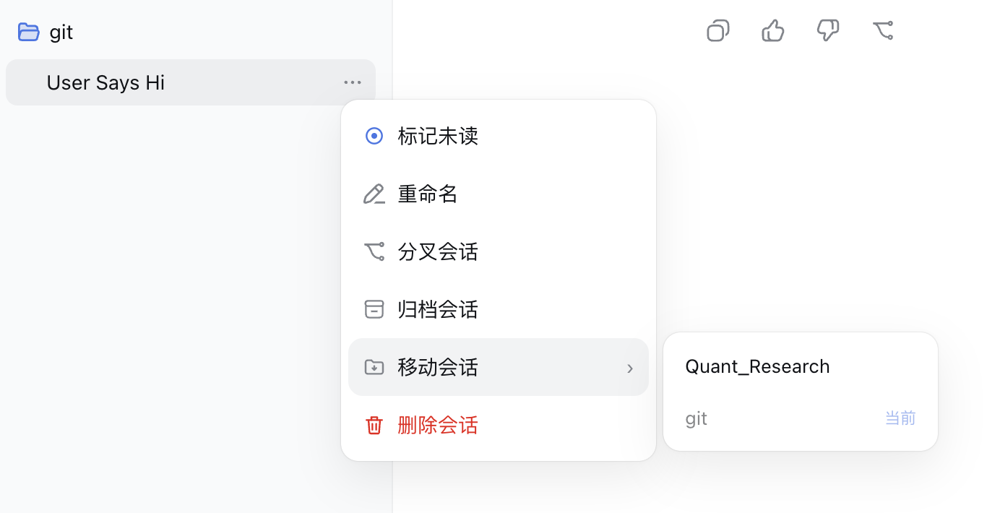
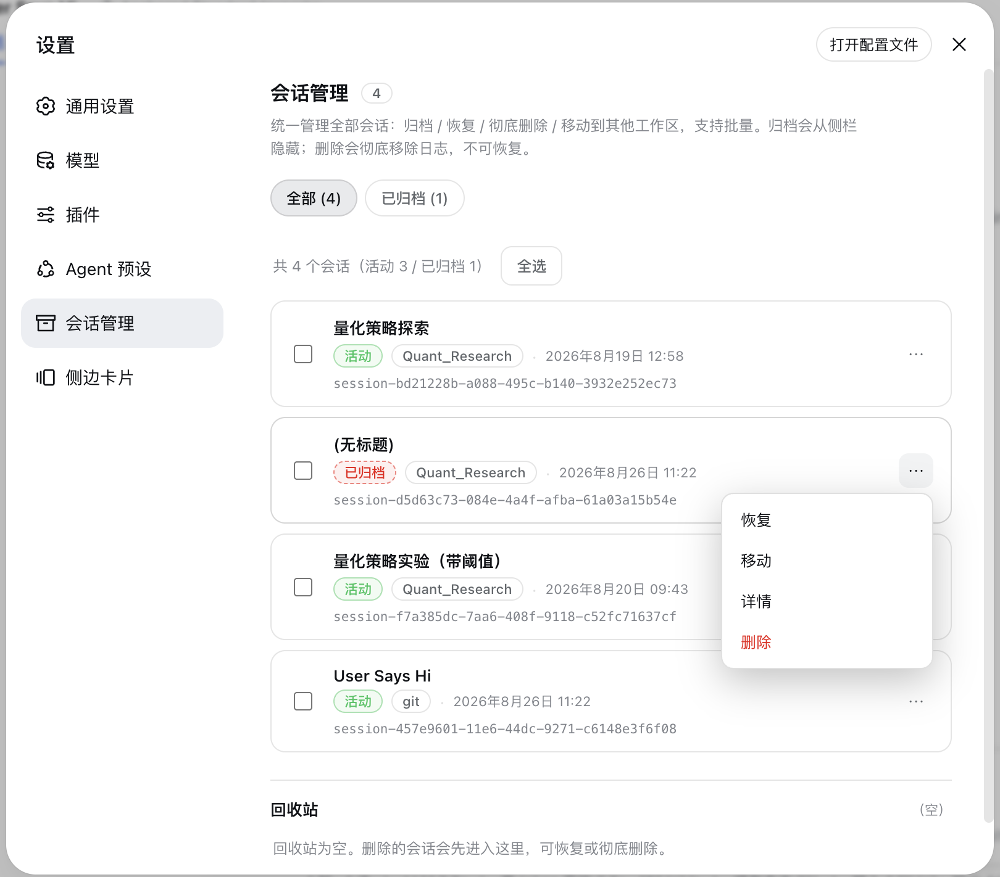
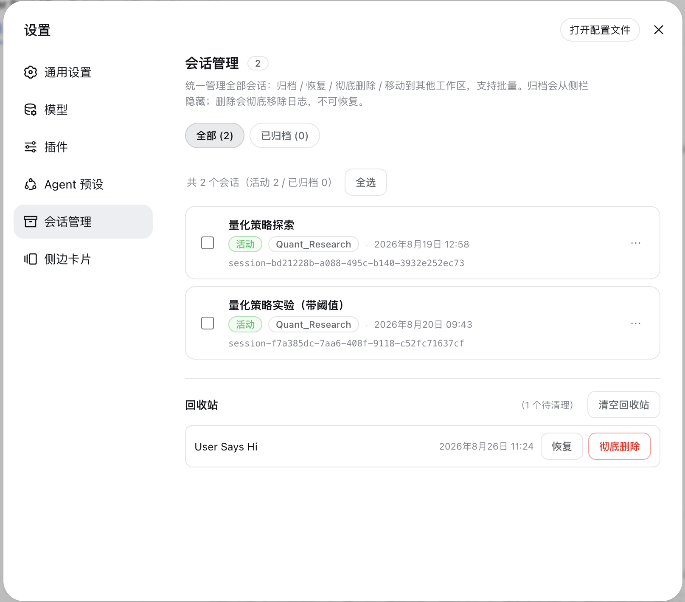

# dsh-sessions-manager

> **Possibly the most stable and polished session manager available for DSH today.**

> 中文 | English


> DSH session manager: archive, move, restore, and inspect sessions from **Settings → 会话管理**; mark unread, move, and delete sessions directly from the **main sidebar**. Deleted sessions go to the recycle bin first and can be restored or permanently purged.

A persistent DSH plugin (host + browser halves). Starting with v3.0.0, it covers both the **settings panel** and the **main sidebar**, so frequent session actions don't require opening Settings.

## Changelog

- **v3.2.2**: engineering hardening, no behavior change. Sidebar decision logic extracted to `src/client/logic.js` (dot semantics / drop validation / fiber row detection) with 13 new regression tests; CI now smoke-tests each runtime version against real cordis and tracks runtime drift.
- **v3.2.1**: zstd session-log safety fix (frame-boundary scan mismatching zstd magic inside compressed data).
- **v3.2.0**: sidebar cross-workspace drag & drop + full session management workbench.

## What's new in v3.2

- **Cross-workspace sidebar drag-and-drop**: drop a session on a workspace heading to move it. It coexists with DSH's native same-group sorting and provides target highlighting, same-workspace protection, failure feedback, and a keyboard-accessible menu fallback.
- **Complete session-management workspace**: All / Active / Archived / Recycle bin in one place, with full search, workspace filters, creation-time or title sorting, batch actions, and result counts.
- **Reliable recycle-bin lifecycle**: soft delete, in-place restore, single permanent purge, empty-all, 7 / 30 / 90-day retention, and log-integrity verification, backed by schema v2, serialized mutations, and atomic writes.
- **No post-delete resurrection**: permanent purge persists a tombstone first, waits for the live Session and persistence controller to retire, removes the log, and rebuilds workspace indexes so neither sessions nor an empty Ungrouped section reappear.
- **Archive-state round trips**: a trashed session returns to the active or archived state it had before deletion; concurrent archive and restore mutations are serialized to prevent duplicate IDs, overwrites, and races.
- **Authoritative cold-start titles**: the latest log-folded `session/title` corrects stale sidebar caches before a renamed session is opened.
- **Safe migration for open sessions**: moving synchronizes the log header, persistence state, live Session, and WorkspaceRegistry, with backup, verification, and rollback on failure.
- **Consistent and accessible UI**: tags use DSH's official 4px radius; destructive actions are confirmed, busy / empty / error states are explicit, and every drag action has a keyboard path.

## Features

### Settings panel: Session Manager

- **Unified panel**: four top-level views — **All / Active / Archived / Recycle bin** — with search across title, session ID, and workspace, plus workspace filters and creation-time/title sorting.
- **Cold-title synchronization**: the sidebar is corrected from the latest log-backed `session/title`, so renamed cold sessions no longer need to be opened before showing their current name.
- **Sidebar workspace drag-and-drop**: drag a session onto a workspace heading to move it, with a highlighted drop target, same-workspace protection, failure feedback, and the More → Move session menu retained for keyboard access.
- **Archive / Restore**: archive hides a session from the sidebar; restore unarchives it and puts it back into its original workspace group.
- **Move to a workspace**: pick an **existing workspace**, or enter a **new directory path** (auto-created); the new-path mode also lets you open the **native OS directory picker** with a **「浏览…」** button. The session's working directory and log are migrated together, and even an open session can be moved safely.
- **Session details**: expand any session to see **disk usage**, **turns / steps / user·assistant messages / tool calls / image attachments** stats, **tool-usage breakdown**, **search·fetch records**, the **write/edit file list** (already filtered for paths that no longer exist on disk), and **lineage** (parent session / child sessions / subagents).
- **Batch multi-select**: select-all / archive selected / restore selected / delete selected (single confirmation for batch delete).

### Main sidebar: session ⋯ menu augmentation

- **Mark unread**: adds a **「标记未读 / 标记已读」** toggle at the top of each session's ⋯ menu; you can also click the status dot to toggle. The mark is automatically cleared when you open the session.
- **Move session**: opens a hover submenu to the right listing workspace names; choose one to move the session there. The current workspace is labeled "当前" and disabled.
- **Delete session**: deletes the session into the **recycle bin** (not an immediate physical delete); you can restore or permanently purge it from the Session Manager panel.

### Main sidebar: status dots

A small dot is rendered to the left of each session row. Its color is driven by DSH's native `StateDot` state:

| Color | State | Description |
|---|---|---|
| 🔵 Blue | Manually marked unread | Toggle via the ⋯ menu or by clicking the dot; auto-cleared when the session is opened |
| 🟡 Yellow | Working | The session is currently running (`running`) |
| 🟠 Amber | Awaiting feedback | The session has a follow-up question and is waiting for your input or confirmation (`warning`) |
| 🟢 Green | Completed but unread | The session is done (`done`) but you haven't reopened it yet; disappears after you view it |
| 🔴 Red | Error / needs attention | The session hit an error (`error`) |
| No dot | Completed and read / idle | — |

The plugin hides DSH's own status dot and re-renders it using the palette above, so the two dots never overlap.

### Recycle bin

- The **Recycle bin** is a dedicated Session Manager view with item counts and deletion dates.
- Normally deleted sessions land in the recycle bin first; they are **not removed from disk immediately**, and they won't be grouped under "未分组".
- Inside the recycle bin you can **restore** a session (back to its original workspace) or **permanently delete** it (physically remove the log).
- **Empty recycle bin** removes all items at once.
- Keep items forever or automatically purge them after 7 / 30 / 90 days, and verify that their log files are intact.
- The recycle-bin index uses a versioned schema, serialized mutations, and atomic writes; legacy array indexes migrate automatically.
- Permanently deleted sessions stay hidden forever and won't reappear in the sidebar or session list.
- Permanent deletion writes a host-side tombstone first, waits for the live Session and persistence controller to retire, removes the log, and rebuilds workspace indexes, preventing stale indexes, reconnects, or an empty Ungrouped section from resurfacing.

## Screenshots








## Install

```sh
# Option 1: install as a Git dependency (recommended — no local clone; restart DSH to apply)
dsh plugin --profile desktop add "github:TOBYCAI/dsh-sessions-manager"

# For the web UI (if you also use dsh web):
dsh plugin --profile web add "github:TOBYCAI/dsh-sessions-manager"

# Option 2: local link (for development)
git clone https://github.com/TOBYCAI/dsh-sessions-manager.git
dsh plugin --profile desktop add link:/path/to/dsh-sessions-manager
```

> After installing, **restart DSH** (or refresh the page to reload the bundle). Then Settings → 会话管理 and the sidebar ⋯ menu become available.

## Uninstall

```sh
dsh plugin --profile desktop remove dsh-sessions-manager
dsh plugin --profile web remove dsh-sessions-manager
```

## Structure

```
package.json       npm metadata + dsh.bundle.patch + dsh.client (browser-half registration)
cordis.patch.yml   inserts this plugin's row into the profile bundle
src/index.js       host source (/archived-sessions/* JSON routes)
src/client/index.jsx  client source (React, settings.section + sidebar DOM augmentation)
build.mjs          esbuild build script (regenerates lib/)
lib/index.js       pre-built host (ESM)
lib/client.js      pre-built client (ModuleLoader CJS handshake)
```

`lib/` is pre-built, so cloning and using it needs no esbuild. To modify the source, run `npm i -D esbuild && npm run build` to regenerate `lib/`.

## Host routes

| Method | Path | Description |
|---|---|---|
| POST | `/archived-sessions/sessions` | List all sessions (with archived flag) for the Session Manager panel |
| POST | `/archived-sessions/list` | List archived sessions (skips deleted / non-existent ones) |
| POST | `/archived-sessions/archive` | Archive (hide) a single session |
| POST | `/archived-sessions/archive-many` | Archive many |
| POST | `/archived-sessions/restore` | Unarchive a single session |
| POST | `/archived-sessions/restore-many` | Unarchive many |
| POST | `/archived-sessions/delete` | Delete a single session — **moves it to the recycle bin** (not an immediate physical delete) |
| POST | `/archived-sessions/delete-many` | Move many sessions to the recycle bin |
| POST | `/archived-sessions/trash/list` | List sessions in the recycle bin |
| POST | `/archived-sessions/trash/restore` | Restore a session from the recycle bin |
| POST | `/archived-sessions/trash/purge` | Permanently delete a single session in the recycle bin |
| POST | `/archived-sessions/trash/purge-many` | Empty / batch permanently delete recycle-bin sessions |
| POST | `/archived-sessions/trash/settings` | Read or update automatic cleanup `{ retentionDays }` |
| POST | `/archived-sessions/trash/verify` | Verify that recycle-bin logs still exist |
| POST | `/archived-sessions/workspaces` | List available target workspaces |
| POST | `/archived-sessions/move` | Move a session to a target workspace `{ sessionId, targetPath }` |
| POST | `/archived-sessions/details` | Session details (disk / stats / tools / fetch / files / lineage) `{ sessionId }` |
| POST | `/archived-sessions/sidebar-state` | Authoritative sidebar titles, recycle-bin IDs, and permanent-deletion tombstones |

> Deleting a session moves it to the recycle bin by default; only "permanently delete" inside the recycle bin physically removes the log. Permanently deleted sessions are hidden forever on the client side so they don't reappear in the sidebar or "ungrouped" due to DSH runtime caching.

## Compatibility

- **Supported platforms**: cross-platform (macOS / Windows / Linux) — wherever DSH runs the plugin runs; the host half is Node (about `^22.19` or `>=24`) and the client is React, with no OS-specific APIs.
- Works in both DSH Desktop and DSH web (same host + client halves).
- Peer dependencies are listed in `package.json`; `react` and `@deepseek-ai/*` are provided by the DSH runtime.

## License

[MIT](./LICENSE) © TOBYCAI
