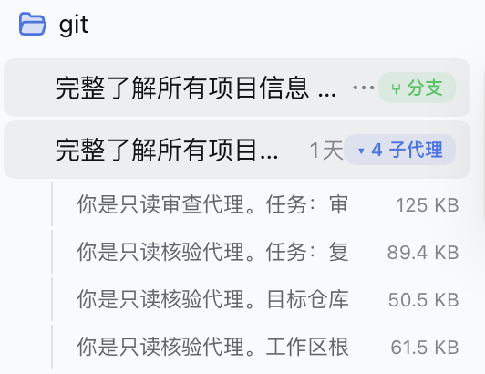
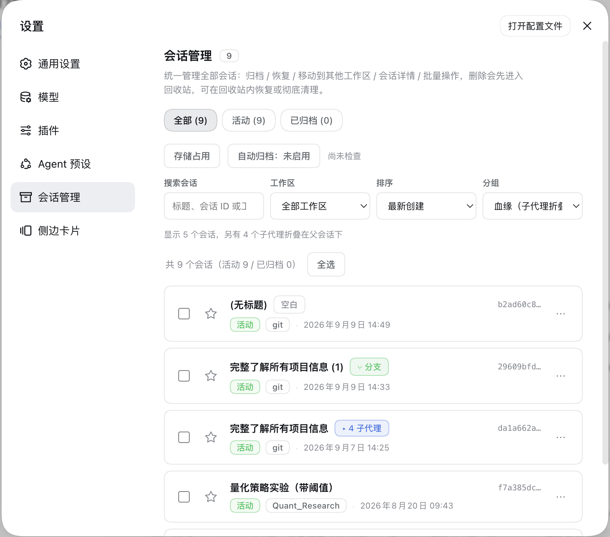
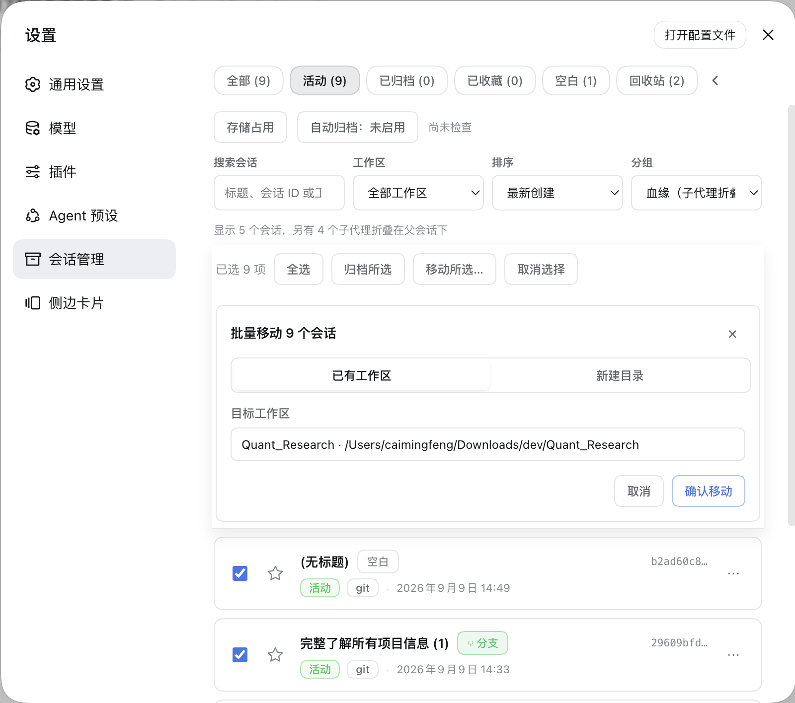
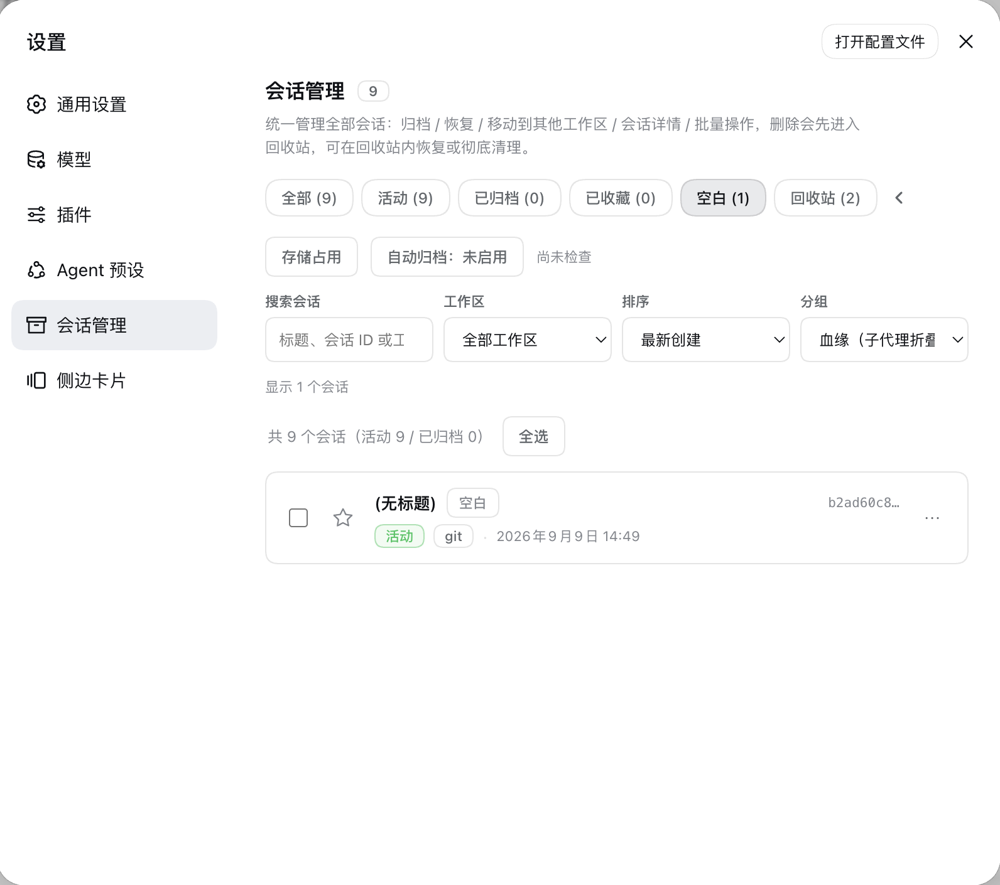
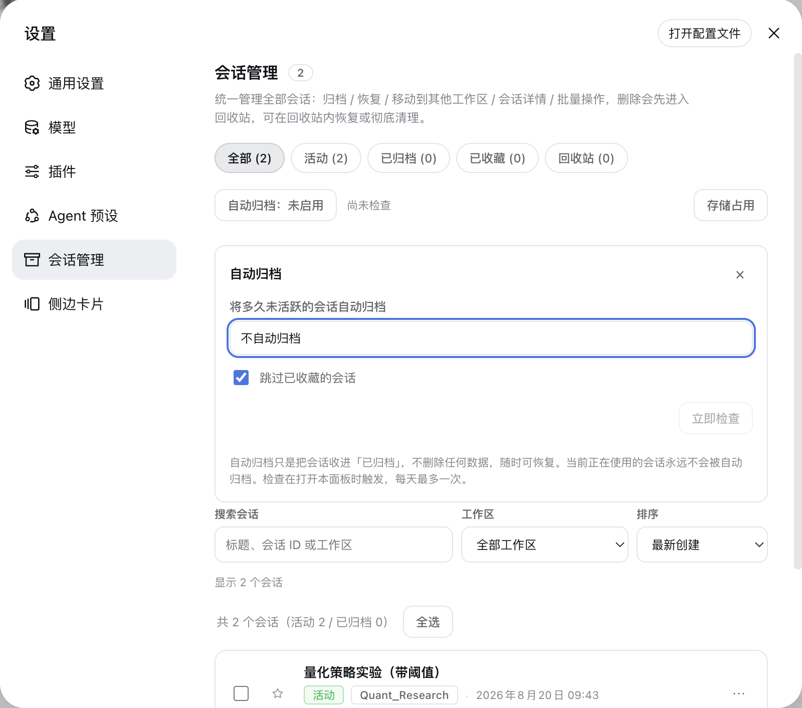
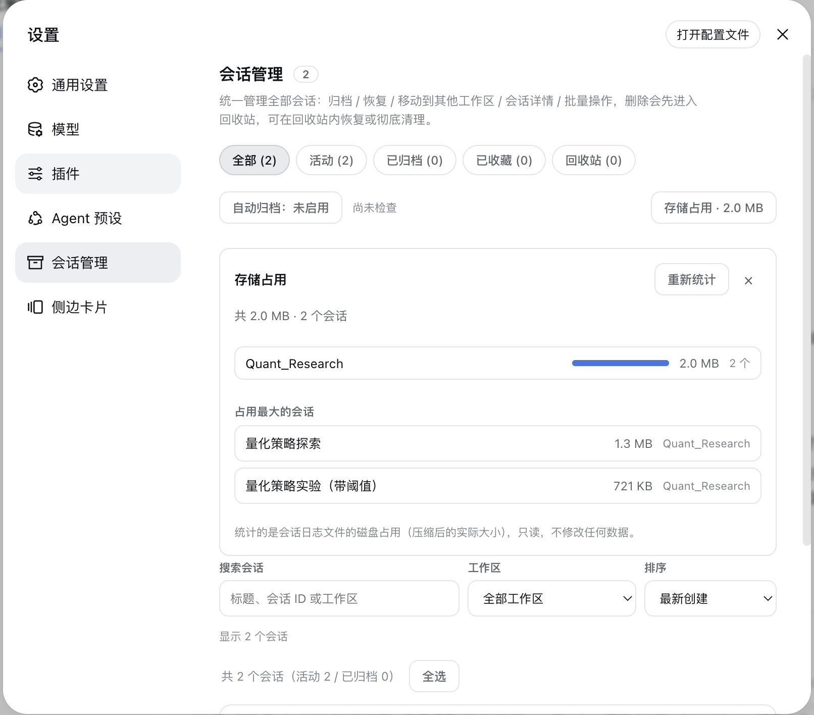
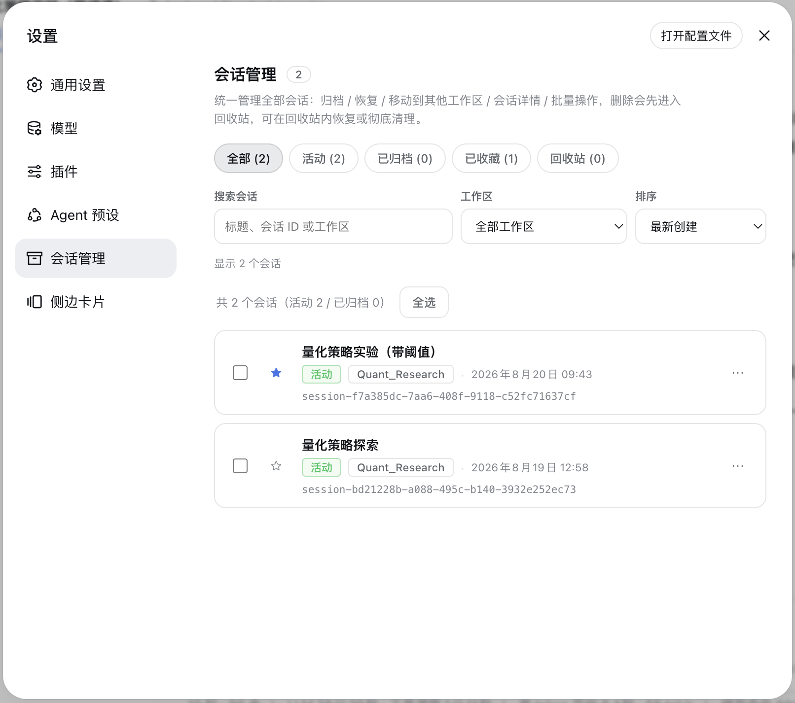

# dsh-sessions-manager

> **Possibly the most stable and polished session manager available for DSH today.**

> 中文 | English


> DSH session manager: archive, move, restore, and inspect sessions **and their lineage** (subagent folding, branch badges, empty-session cleanup) from **Settings → 会话管理**; mark unread, move, and delete sessions directly from the **main sidebar**, with subagents folded in place under their parents. Deleted sessions go to the recycle bin first and can be restored or permanently purged.

A persistent DSH plugin (host + browser halves) covering both the **settings panel** and the **main sidebar**, so frequent session actions don't require opening Settings. It understands both legacy header lists/`readFrom` and the new snapshot/`SessionHandle` API, enabling actions according to the current Runtime's verified capabilities. Purge and migration paths are enabled only when they can be verified — on newer runtimes they are backed by guarded path derivation and write-ownership probes; anything unverifiable is disabled in both UI and Host to prevent false success.

## Features

### Settings panel: Session Manager

- **Unified panel**: three always-visible top-level views — **All / Active / Archived** — while the low-frequency ones (**Starred / Empty / Recycle bin**) are tucked behind an arrow button at the end of the filter row and slide out horizontally on click (they stay expanded automatically while a low-frequency view is selected). Search across title, session ID, and workspace, plus workspace filters and creation-time/title sorting. The result line is a single sentence such as "Showing 5 sessions, 4 more subagents folded under their parents". A maintenance row below the filters holds the **Storage usage** and **Auto-archive** tools, which expand on demand instead of taking up a view.
- **Starred sessions**: an always-visible star button on each session row toggles starring optimistically with rollback on failure; the Starred view is orthogonal to DSH's active/archived states and they stack. The star index is plugin-owned (schema v3) and never touches DSH logs; stars are cleaned up automatically when a session is permanently purged.
- **Tags & saved filters**: label sessions with custom tags (up to 200 global, 10 per session; rename, merge, delete — **deleting a tag never touches the sessions**), filter the list by tag, and save the current "view + workspace + sort + tag" combination as a preset (up to 20) for one-click reuse. Tags and presets live in plugin-owned indexes (same discipline as the star index) inside this machine's DSH data directory — they do not follow your account; cross-machine migration belongs to the 3.10.0 backup scope.
- **Cold-title synchronization**: the sidebar is corrected from the latest log-backed `session/title`, so renamed cold sessions no longer need to be opened before showing their current name. On cold starts of large stores a title that is not ready yet simply renders blank while it fills in the background — and once it arrives, **rows already on screen and the “⑂ branch” chip's tooltip update automatically**, no page rebuild needed.
- **Sidebar workspace drag-and-drop**: drag a session onto a workspace heading to move it, with a highlighted drop target, same-workspace protection, failure feedback, and the More → Move session menu retained for keyboard access.
- **Archive / Restore**: archive hides a session from the sidebar; restore unarchives it and puts it back into its original workspace group.
- **Move to a workspace**: pick an **existing workspace**, or enter a **new directory path** (auto-created); the new-path mode also lets you open the **native OS directory picker** with a **「浏览…」** button. The session's working directory and log are migrated together. On the legacy runtime (`0.1.2-rc.1`) even an open session can be moved immediately; on newer runtimes session logs are **single-writer** (DSH claims write ownership when it opens a session and releases it only at process exit), so such a move is **queued automatically** instead of failing and completes on its own once the session is released — see "Moving an active session (queued moves)" below.
- **Session details**: expand any session to see **disk usage**, **turns / steps / user·assistant messages / tool calls / image attachments** stats, **tool-usage breakdown**, **search·fetch records**, the **write/edit file list** (already filtered for paths that no longer exist on disk), and **lineage** (parent session / child sessions / subagents).
- **Lineage disclosure**: the panel's **Grouping** select offers **Lineage (folded groups, default)** and **Flat (all inline)** views. Under lineage grouping, subagent sessions fold under their parents ("▸ N 子代理"), and sessions forked from the same source are **gathered into branch groups** ("▸ N 分支", oldest first by creation time; the source row stays in place, and if the parent is filtered out / archived / deleted the group degrades to a "来源：<短 ID>" header — no row is ever lost, so branches of an archived parent do hang under a "source" header in the Active view by design). Grouping lives in the panel; the sidebar only badges rows (React-owned DOM, never reordered). Fork sessions also carry the green **"⑂ 分支"** badge (hover shows the source parent; the title is late-arriving data and refreshes itself), and empty sessions carry a gray badge with a dedicated **Empty** view for reviewing and cleaning them up. Empty sessions are identified by an **event-type method**: since `0.1.3` the log header grew and every creation writes a lifecycle-metadata frame, so the old size threshold no longer holds — the plugin decodes candidate sessions through the official API and marks one empty only when no content event exists beyond the header (decode failures fall back to non-empty). Since 3.7.0 the checks run entirely off the request path: sidebar data answers immediately with empties marked "unknown" (unknown is never hidden and never counted as empty), a small background queue resolves candidates session by session, verdicts persist across restarts, and later polls converge automatically — zero-decode lineage such as the "⑂ branch" chip is no longer gated behind any refinement work.
- **Export**: the detail panel offers two actions — "**Download raw log (ZIP)**" goes straight to DSH's official `session.export` endpoint (subsessions + attachments included, hidden automatically when the persistence backend lacks raw-artifact support); "**Export Markdown**" renders the session into a human-readable transcript (front matter + per-turn sections + user / assistant / tool-call summaries, with no streaming-delta duplication).
- **Storage analysis**: a **Storage usage** button in the maintenance row expands on demand to aggregate per-workspace disk usage of session logs (share bars + session counts) and list the Top 10 largest sessions. Read-only statistics that never modify any data; collapsed by default, so nothing is scanned until you open it.
- **Auto-archive**: optionally move sessions that have been **inactive for 30 / 60 / 90 days** into **Archived**, **off by default**. The session you are currently using and any starred session (that guard can be turned off) are never auto-archived; it only sets an archived flag and never deletes data, so recovery is always one click away. The check is lazily triggered when you open the panel, at most once per day, and can also be run manually with "Check now".
- **Batch multi-select**: select-all / archive selected / restore selected / delete selected (single confirmation for batch delete). Once anything is selected, the batch action bar **pins to the top** of the panel (sticky), so a long list never forces you to scroll back up to act; a **"Move selected…"** action adds batch cross-workspace moves (reusing the single-move sheet: existing workspace / new directory / native directory picker). One failing session never blocks the rest — failures are reported one by one.

### Main sidebar: session ⋯ menu augmentation

- **Mark unread**: adds a **「标记未读 / 标记已读」** toggle at the top of each session's ⋯ menu; you can also click the status dot to toggle. The mark is automatically cleared when you open the session.
- **Move session**: opens a hover submenu to the right listing workspace names; choose one to move the session there. The current workspace is labeled "当前" and disabled.
- **Delete session**: deletes the session into the **recycle bin** (not an immediate physical delete); you can restore or permanently purge it from the Session Manager panel.

### Main sidebar: subagent folding and branch badges

- **Subagent folding**: DSH's upstream sidebar intentionally never renders subagent rows, so the plugin injects them **in place** under their parent session using the official lineage fields (`origin: 'subagent'` / `parentSession` / `delegationDepth`). A **"▸ N 子代理"** badge appears when the parent row is selected or hovered; clicking it expands the indented subagent rows, and clicking a row opens that subagent via the official API. The folded list shrinks as soon as a subagent is deleted.
- **Branch badges**: sessions created by forking a parent show a green **"⑂ 分支"** (branch) chip when their row is selected or hovered, hinting at their lineage.
- **Empty sessions**: since `0.1.3` the upstream sidebar doesn't render empty sessions; the plugin hides them too as the fixed default, so managing them lives in the panel's **Empty** view.

### Main sidebar: status dots

A small dot is rendered to the left of each session row. Its color is driven by DSH's native `StateDot` state:

| Color | State | Description |
|---|---|---|
| 🔵 Blue | Manually marked unread | Toggle via the ⋯ menu or by clicking the dot; auto-cleared when the session is opened |
| 🟡 Yellow | Working | The session is currently running (`ongoing`, with legacy `running` compatibility) |
| 🟠 Amber | Awaiting feedback | The session has a follow-up question and is waiting for your input or confirmation (`warning`) |
| 🟢 Green | Completed but unread | The session is done (`done`) but you haven't reopened it yet; disappears after you view it |
| 🔴 Red | Error / needs attention | The session hit an error (`error`) |
| No dot | Completed and read / idle | — |

The plugin hides DSH's own status dot and re-renders it using the palette above, so the two dots never overlap.

### Recycle bin

- The **Recycle bin** is a dedicated Session Manager view with item counts and deletion dates.
- Normally deleted sessions land in the recycle bin first; they are **not removed from disk immediately**, and they won't be grouped under "未分组".
- Inside the recycle bin you can **restore** a session (back to its original workspace) or **permanently delete** it (physically remove the log).
- **Empty recycle bin** removes all items at once.
- Keep items forever or automatically purge them after 7 / 30 / 90 days, and verify that their log files are intact.
- The recycle-bin index uses a versioned schema, serialized mutations, and atomic writes; legacy array indexes migrate automatically.
- Permanently deleted sessions stay hidden forever and won't reappear in the sidebar or session list.
- Permanent deletion writes a host-side tombstone first, waits for the live Session and persistence controller to retire, removes the log, and rebuilds workspace indexes, preventing stale indexes, reconnects, or an empty Ungrouped section from resurfacing.

### Moving an active session (queued moves)

Since DSH 0.1.5 every session log has a **single-writer lock**: once a session is open in DSH (even just selected as the current conversation) the agent loop owns its write handle. **The host exposes no "close session" action and no way to release that ownership — it is released only when the DSH process exits** (switching away does not release it, and empirically neither does idle waiting). Forcing the move at that point is dangerous: the live writer keeps appending to the old file and re-materialises a shell at the old path.

So held-open sessions get **deferred (queued) moves**:

- The request does not fail; the move is recorded in a pending queue (`~/.dsh/sessions-manager/pending-moves.json`) and the plugin reports **"queued" honestly** — it never claims "moved" for a move that did not happen.
- The queue runs automatically **immediately after plugin startup and retries densely** (0 / 1 / 3 / 6 / 12 / 30 s — it must win the race against the browser opening sessions), then on a light 2-minute fallback, and whenever the host releases a session.
- Up to 50 entries are kept; an entry that fails 5 times for **non-lock** reasons is dropped and logged (failures within the first 30 s after startup do not count, so a startup race cannot silently drop your queue).
- Inspect / cancel: `POST /archived-sessions/pending-moves`, `POST /archived-sessions/pending-moves/cancel { sessionIds }`; while the queue is non-empty the panel also shows a **Pending moves queue** section with per-entry cancel.
- **Results are no longer silent**: a background completion or a final give-up (5 consecutive non-lock failures) becomes a persisted notice, surfaced as a toast the next time a DSH page is open (give-ups include the reason). Notices stay on the server until acknowledged (up to 20, at most 7 days) — closing the page before the toast never loses one.
- **To actually move an active session**: request the move (it queues), then **restart DSH and don't open that session first** — it completes a few seconds after startup. Pending entries survive restarts.

### Session format v3 (DSH 0.1.5+)

DSH 0.1.5 upgrades the session log format to **v3**; the runtime performs the migration itself while reading:

- Migration is **automatic** and **keeps the original files** — so one session directory legitimately holds both `session.v2.jsonl.zstd` and `session.v3.jsonl.zstd`. This plugin always reads the **highest generation**, matching the runtime.
- Migration is **one-way, with no downgrade read**: after upgrading to 0.1.5 and opening sessions, rolling the runtime back makes those sessions unreadable. Back up `~/.dsh/sessions` before a rollback.
- Only **supported** old logs are migrated; unknown events, v2 events already carrying reserved v3 tags, or corrupted data are **refused without any repair**. Such sessions surface as `SessionFormatUnsupportedMigrationError` / `SessionFormatError` on read/move — the plugin cannot repair them and reports the error verbatim.

## Screenshots

<details>
<summary>Expand screenshots (sidebar menu / sidebar subagent folding / settings panel / batch move / empty view / auto-archive / storage analysis / starred / recycle bin / session details)</summary>

















</details>

## Install

```sh
# Option 1: install as a Git dependency (recommended — no local clone; restart DSH to apply)
dsh plugin --profile desktop add "github:TOBYCAI/dsh-sessions-manager"

# For the web UI (if you also use dsh web):
dsh plugin --profile web add "github:TOBYCAI/dsh-sessions-manager"

# Option 2: local link (for development)
git clone https://github.com/TOBYCAI/dsh-sessions-manager.git
dsh plugin --profile desktop add link:/path/to/dsh-sessions-manager
```

> After installing, **restart DSH** (or refresh the page to reload the bundle). Then Settings → 会话管理 and the sidebar ⋯ menu become available.

## Uninstall

```sh
dsh plugin --profile desktop remove dsh-sessions-manager
dsh plugin --profile web remove dsh-sessions-manager
```

## Structure

```
package.json       npm metadata + dsh.bundle.patch + dsh.client (browser-half registration)
cordis.patch.yml   inserts this plugin's row into the profile bundle
src/index.js       host source (/archived-sessions/* JSON routes)
src/client/index.jsx  client source (React, settings.section + sidebar DOM augmentation)
src/auto-archive.js   auto-archive settings (schema v4) + candidate-selection pure functions
src/storage-stats.js  storage-usage aggregation (pure functions, by workspace / Top N)
src/lineage.js        lineage classification and empty-session detection (pure functions, event-type method)
src/empty-scan-index.js persisted empty-verdict cache (cross-restart reuse, fingerprint + TTL gates)
build.mjs          esbuild build script (regenerates lib/)
lib/index.js       pre-built host (ESM)
lib/client.js      pre-built client (ModuleLoader CJS handshake)
```

`lib/` is pre-built, so cloning and using it needs no esbuild. To modify the source, run `npm i -D esbuild && npm run build` to regenerate `lib/`; before committing, `npm run check:dist` rebuilds and diffs `lib/` against the committed bundles (CI runs the same check), so **always rebuild after a version bump** — the build stamp is reproducible as `vX.Y.Z+source-hash`, which is what makes that comparison exact.

## Host routes

| Method | Path | Description |
|---|---|---|
| POST | `/archived-sessions/sessions` | List all sessions (with archived flag) for the Session Manager panel |
| POST | `/archived-sessions/list` | List archived sessions (skips deleted / non-existent ones) |
| POST | `/archived-sessions/archive` | Archive (hide) a single session |
| POST | `/archived-sessions/archive-many` | Archive many |
| POST | `/archived-sessions/restore` | Unarchive a single session |
| POST | `/archived-sessions/restore-many` | Unarchive many |
| POST | `/archived-sessions/delete` | Delete a single session — **moves it to the recycle bin** (not an immediate physical delete) |
| POST | `/archived-sessions/delete-many` | Move many sessions to the recycle bin |
| POST | `/archived-sessions/trash/list` | List sessions in the recycle bin |
| POST | `/archived-sessions/trash/restore` | Restore a session from the recycle bin |
| POST | `/archived-sessions/trash/purge` | Permanently delete a single session in the recycle bin |
| POST | `/archived-sessions/trash/purge-many` | Empty / batch permanently delete recycle-bin sessions |
| POST | `/archived-sessions/trash/settings` | Read or update automatic cleanup `{ retentionDays }` |
| POST | `/archived-sessions/trash/verify` | Verify that recycle-bin logs still exist |
| POST | `/archived-sessions/workspaces` | List available target workspaces |
| POST | `/archived-sessions/move` | Move a session to a target workspace `{ sessionId, targetPath }`; when the session is held open by DSH it returns `{ queued: true }` and queues the move |
| POST | `/archived-sessions/move-many` | Batch cross-workspace move `{ sessionIds, targetPath }` — one failure never blocks the rest, failures are reported per session, held-open sessions land in `queued`, and the grouping index is rebuilt once at the end |
| POST | `/archived-sessions/pending-moves` | Inspect the pending-move queue (sessions queued while held open; completed automatically once released) |
| POST | `/archived-sessions/pending-moves/cancel` | Cancel queued moves `{ sessionIds }` |
| POST | `/archived-sessions/pending-moves/notices/ack` | Acknowledge queued-move outcome notices (cleared once shown; unacknowledged ones live at most 7 days) |
| POST | `/archived-sessions/details` | Session details (disk / stats / tools / fetch / files / lineage) `{ sessionId }` |
| POST | `/archived-sessions/sidebar-state` | Authoritative sidebar titles, recycle-bin IDs, permanent-deletion tombstones, **lineage disclosure** (subagent / branch / empty badges), , `warmPending` / `refinePending` (whether the title-warming and empty-refinement background queues still have work in flight) and `moveNotices` (queued-move outcome notices; omitted when empty) |
| POST | `/archived-sessions/lineage-tree` | Recursive subagent tree (feeds the panel's Lineage grouping and the sidebar folding), filtered for recycle-bin and tombstoned sessions |
| POST | `/archived-sessions/star/set` | Star / unstar sessions `{ sessionId or sessionIds, starred }` |
| POST | `/archived-sessions/tags/list` | Tag definitions + session→tag map `{ tags, assignments }` |
| POST | `/archived-sessions/tags/create` | Create a tag `{ name }` (duplicate/over-cap rejected with stable codes) |
| POST | `/archived-sessions/tags/rename` | Rename `{ id, name }` (id is stable) |
| POST | `/archived-sessions/tags/merge` | Merge `{ fromId, toId }` (deduped; source tag disappears) |
| POST | `/archived-sessions/tags/delete` | Delete a tag `{ id }` (definitions + assignments only, never sessions) |
| POST | `/archived-sessions/tags/set` | Replace one session's tags wholesale `{ sessionId, tagIds }` |
| POST | `/archived-sessions/filters/list` / `save` / `delete` | Filter presets `{ name, filters }` (≤20; filters is an opaque payload) |
| GET | `/archived-sessions/export-md?sessionId=` | Single-session Markdown export (human-readable transcript) |
| POST | `/archived-sessions/storage` | Storage-usage aggregation (per-workspace ranking + largest sessions) `{ topN }` |
| POST | `/archived-sessions/auto-archive/settings` | Read or update the auto-archive policy `{ inactiveDays, skipStarred }`; reading lazily triggers the daily check |
| POST | `/archived-sessions/auto-archive/run` | Run a one-off auto-archive check immediately (ignores the daily throttle) |
| POST | `/archived-sessions/capabilities` | Report the persistence generation and per-action read/archive/trash/purge/cross-workspace-move capabilities |

> Deleting a session moves it to the recycle bin by default; only "permanently delete" inside the recycle bin physically removes the log. Permanently deleted sessions are hidden forever on the client side so they don't reappear in the sidebar or "ungrouped" due to DSH runtime caching.

## Compatibility

- **Supported platforms**: cross-platform (macOS / Windows / Linux) — wherever DSH runs the plugin runs; the host half is Node (about `^22.19` or `>=24`) and the client is React, with no OS-specific APIs.
- Works in both DSH Desktop and DSH web (same host + client halves).
- Peer dependencies are listed in `package.json`; `react` and `@deepseek-ai/*` are provided by the DSH runtime.
- `0.1.2-rc.1`: the existing read, archive, recycle-bin, permanent-purge, and cross-workspace move paths remain available.
- `0.1.3-alpha.1`: snapshot lists and chunked `SessionHandle` read flows are supported. Permanent purge and cross-workspace move are available through guarded path derivation + write-ownership probes (see the behavior notes below), and disable themselves whenever a safe path cannot be verified; other management capabilities are unaffected. The panel shows the effective capabilities.
- `0.1.5-rc.1` / `0.1.5-rc.2` (current runtimes; the two are byte-identical across every API this plugin uses, both verified): the session log format is upgraded to **v3** and this plugin is adapted — it reads the **highest generation** (matching the runtime), tolerates v0/v2/v3 generations side by side, follows the new `SessionHandle.read()` shape (`{ eventState, events }`), moves sessions as **whole-directory moves** (reclaiming superseded-generation copies automatically), and queues moves for sessions DSH holds open (see "Moving an active session" above).
- Unverified future runtimes expose only capabilities the plugin can safely identify; method presence alone is not presented as behavioral compatibility.

### Behavior differences and degradations on the SessionHandle era (`0.1.3+`)

- **Recycle-bin restore is verified**: before restoring, the plugin confirms the underlying stored session still exists (live / `stat` / listing, in that order). It returns accurate errors when the session is gone (`DSM_SESSION_MISSING`), was permanently purged (`DSM_SESSION_PURGED`), or the index still lists it but the log file has vanished (`DSM_SESSION_LOG_MISSING`); when the log location cannot be verified the entry is honestly reported as `unverified` instead of silently passing. Restoring a session whose workspace was deleted succeeds and notes that it now lives under "未分组" (ungrouped).
- **Permanent purge / empty recycle bin / automatic physical cleanup**: the official public contract offers no delete API, so the plugin keeps the legacy-era semi-official approach — a **three-layer guarded path derivation** starting from the backend instance's storage-root field (root → session directory structure → session-id ownership check), followed by a whole-directory removal verified with the official `stat`. Sessions with an active writer are refused (409). When the derivation fails (e.g. the storage root is unavailable), the actions degrade to disabled with an explicit reason instead of deleting blindly.
- **Cross-workspace move**: the primary path replays events through the official `create` + `append` (writer-ownership probe refuses sessions whose write ownership is held by DSH, before/after `revision` checks guard against concurrent writes, backup + rollback guarantees no half-moved state on failure); when the backend holds a ghost record for the same id it falls back to relocating the log with a frame0 cwd rewrite (frame count and content verified byte-for-byte). Paths come from the same guarded derivation; the workspace grouping index is rebuilt automatically after the move — no restart needed. Since runtime `0.1.5` a session may keep **several log generations side by side** (the runtime publishes a newer generation but keeps the older ones: `session.jsonl.zstd` + `session.v2.jsonl.zstd` + `session.v3.jsonl.zstd`), while the runtime insists that one id lives in exactly one project directory — so a move is a **whole-directory move**: the source session directory is renamed out of sight first, the target is materialized and verified, then the source directory is deleted. Superseded older-generation copies left in other project directories by earlier versions are **reclaimed automatically**, so a session can never get stuck as a cross-directory duplicate.
- **Purge tombstones never suppress new sessions**: if a session with the same id is recreated later, the tombstone yields automatically and the new session appears normally in lists and the sidebar.
- **Metadata cache**: whether a session log changed is judged by the official snapshot's `revision` on newer runtimes (comparable only within one process, and never written to any cross-restart cache file), or by the file's `(mtime, size)` fingerprint on legacy runtimes. A list's folder and creation time come straight from the snapshot header without reading logs; titles are never decoded during page loads either — a session whose title is not cached yet simply renders blank, and the list refreshes itself once the background pass fills it in. **A failed read is kept apart from a session that genuinely has no title**: failures are never cached and are retried later (immediately once that session's log changes), so one transient failure can't leave a session stuck at "(untitled)".
- **Auto-archive**: the new runtime exposes no reliable "last activity" timestamp; the sweep skips (`no-activity-data`) when idleness cannot be proven, and never archives on a guess.
- **Sidebar injection**: DOM / React fiber recognition is centralized in a versioned adapter; when the upstream sidebar shape is no longer recognized, all injections degrade safely and the official sidebar is left untouched. While recognition works, updates are driven incrementally by a MutationObserver with only a low-frequency fallback check.
- **Lineage disclosure**: subagent sessions are recognized via the official header fields (`origin: 'subagent'`, `parentSession`, `delegationDepth`); since the upstream sidebar renders neither subagent nor empty sessions, the plugin injects subagent rows under their parent and hides empty rows. Empty detection uses the **event-type method** — `0.1.3` always writes one lifecycle-metadata frame at creation (`permission/preset` / `sandbox/mode` / `approval/policy`), which breaks the old size threshold; candidates up to 8KB (compressed) are decoded once through the official API and marked empty only when no content event exists beyond the header, decode failures fall back to non-empty. Verdicts are cached per session under a cross-restart size fingerprint and persisted to disk (only genuinely decoded verdicts are; failures never are), the queue yields the event loop between batches, and sidebar responses stay decode-free end to end.

## License

[MIT](./LICENSE) © TOBYCAI
