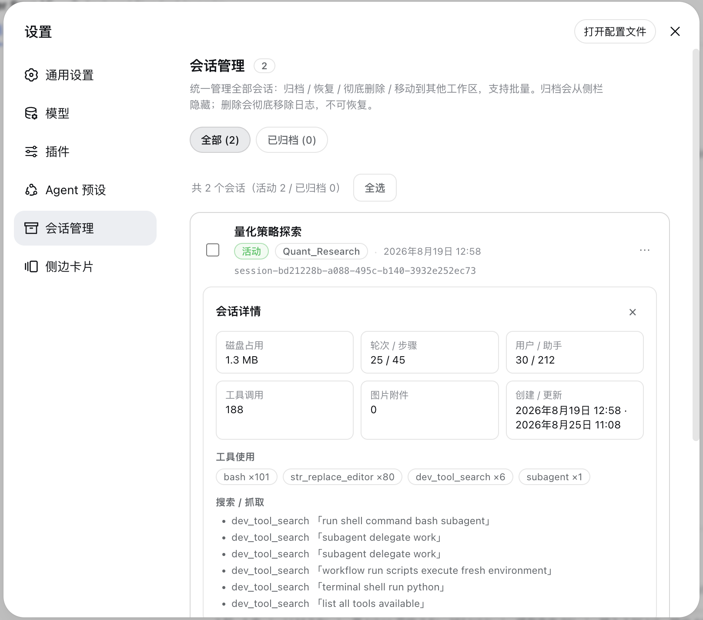

# dsh-sessions-manager

> 中文 | [English](./README.en.md)


> DSH 设置面板**「会话管理」**：一个入口统一管理全部会话。
> 归档 / 恢复 / 彻底删除 / 移动到其他工作区，带工作区标签与会话日期，支持批量。
> 工作区目录可选「已有」或「新建」，新建支持**系统目录选择**；设置导航带专属归档盒图标。

一个 DSH 持久化插件（host + browser 双半）。在 **设置 → 会话管理** 里统一管理所有会话：归档（从侧栏隐藏）、恢复、彻底删除、移动到其他工作区。

## 功能

- **统一面板**：单一「会话管理」入口，顶部「全部 / 已归档」筛选；每行显示标题（缺失时回退首条用户消息）、**归档状态**（活动 / 已归档）、**会话日期**、**所属工作区标签**（标题或目录名；原工作区已删除时显示「工作区已删 · 目录名」）。
- **归档 / 恢复**：归档把会话从侧栏隐藏；恢复取消归档放回原分组。
- **彻底删除**：物理删除会话日志文件 + 解除工作区归属，**不可恢复**（删除前有二次确认）。
- **移动到工作区**：任选**已有工作区**或**新建目录路径**（自动创建）；新建目录支持直接输入路径或点击 **「浏览…」调用系统目录选择窗口**。会话的工作目录与日志会一起迁移，随后滑入对应工作区分组；即使会话处于打开状态也可安全移动（日志随会话迁移，活动会话的内存对象会同步到新路径）。
- **批量多选**：全选 / 批量归档 / 恢复所选 / 删除所选（批量删除一次二次确认）。
- **自适应 UI**：深浅色跟随主题 token，窄屏自动纵向堆叠；加载/空/错误/操作中状态齐全；支持键盘焦点、`prefers-reduced-motion`；设置导航左侧为归档盒专属图标。
- **会话详情（v2.0.0）**：每条会话可点「详情」展开，展示**磁盘占用**、**轮次 / 步骤 / 用户·助手消息 / 工具调用 / 图片附件**统计、**工具使用分布**、**搜索·抓取记录**、**write/edit 写过的文件列表**（已过滤磁盘上已不存在的路径）、以及**血统**（父会话 / 子会话 / 子代理），便于了解每条会话的成本与产出、清理大文件。详情统计参考社区插件 `Zephyr-vibe/dsh-archived-sessions` 的实现思路。

## 截图




## 安装

```sh
# 方式一：Git 依赖直装（推荐，无需本地 clone，重启 DSH 生效）
dsh plugin --profile desktop add "github:TOBYCAI/dsh-sessions-manager"

# web 端（若你也用 dsh web）：
dsh plugin --profile web add "github:TOBYCAI/dsh-sessions-manager"

# 方式二：本地 link（开发调试）
git clone https://github.com/TOBYCAI/dsh-sessions-manager.git
dsh plugin --profile desktop add link:/path/to/dsh-sessions-manager
```

> 装完**重启 DSH**（或刷新页面重新加载 bundle）后，设置 → 会话管理 即可用。

## 卸载

```sh
dsh plugin --profile desktop remove dsh-sessions-manager
dsh plugin --profile web remove dsh-sessions-manager
```

## 结构

```
package.json       npm 元数据 + dsh.bundle.patch + dsh.client（浏览器半注册）
cordis.patch.yml   向 profile bundle 插入本插件行
src/index.js       host 源码（/archived-sessions/* JSON 路由）
src/client/index.jsx  client 源码（React，settings.section）
build.mjs          esbuild 构建脚本（本地开发时生成 lib/）
lib/index.js       预构建 host（ESM）
lib/client.js      预构建 client（ModuleLoader CJS handshake）
```

`lib/` 已预构建，clone 下来即可直接用、无需 esbuild。若要改源码，运行 `npm i -D esbuild && npm run build` 重新生成 `lib/`。

## Host 路由

| 方法 | 路径 | 说明 |
|---|---|---|
| POST | `/archived-sessions/list` | 列出归档会话（跳过已删除/不存在者） |
| POST | `/archived-sessions/archive` | 归档（隐藏）单个会话 |
| POST | `/archived-sessions/archive-many` | 批量归档 |
| POST | `/archived-sessions/restore` | 取消归档单个 |
| POST | `/archived-sessions/restore-many` | 批量取消归档 |
| POST | `/archived-sessions/delete` | 彻底删除单个（物理删日志，保持隐藏） |
| POST | `/archived-sessions/delete-many` | 批量彻底删除 |
| POST | `/archived-sessions/sessions` | 列出全部会话（含已归档标记），供「会话管理」面板 |
| POST | `/archived-sessions/workspaces` | 列出可选目标工作区 |
| POST | `/archived-sessions/move` | 把会话移动到目标工作区 `{ sessionId, targetPath }` |
| POST | `/archived-sessions/details` | 会话详情（磁盘/统计/工具/fetch/文件/血统）`{ sessionId }` |

> 删除时会**保留归档位**（不取消归档），从而不会把会话放回侧栏/未分组；并跳过日志已不存在的条目。
> DSH 本身没有官方 session 删除接口，本插件是「物理删日志 + 解除归属 + 保持隐藏」的实现。

## 兼容性

- **适配系统**：跨平台（macOS / Windows / Linux）——只要 DSH 能在该系统运行即可；本插件 host 基于 Node（约 `^22.19` 或 `>=24`）、浏览器端为 React，不依赖特定操作系统 API。
- DSH Desktop / web 均可（同一套 host + client）。
- peerDependencies 见 `package.json`；`react`、`@deepseek-ai/*` 由 DSH 运行时提供。

## License

[MIT](./LICENSE) © TOBYCAI
